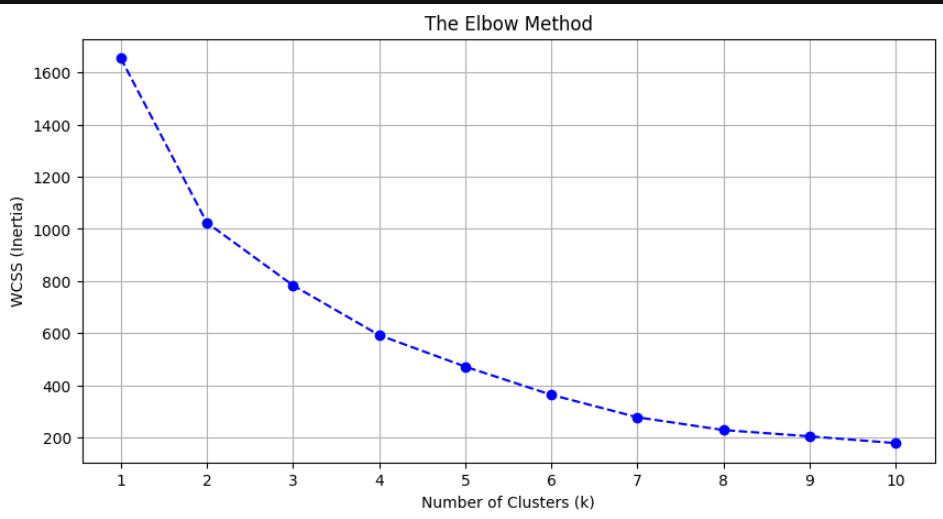
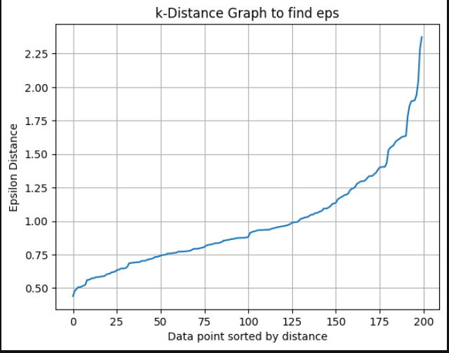
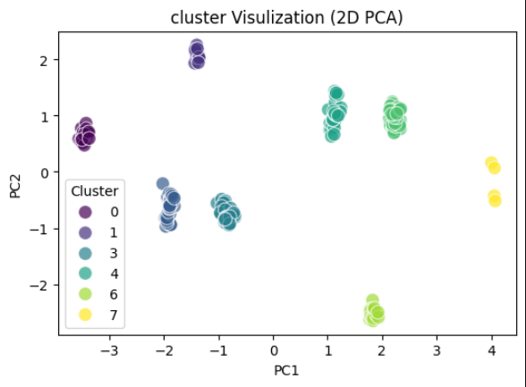
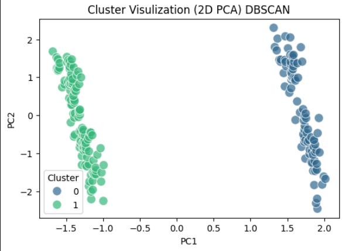

# Customer Segmentation Analysis Report
---
## 1.Project Overview
The goal of this analysis was to segment customers based on their Annual Income and Spending Score using an unsupervised machine learning approach. By identifying distinct groups, we can tailor marketing strategies and improve customer retention.

## 2.Methodology
* **Algorithm**: K-Means Clustering, DBSCAN.
* **Optimal Clusters ($k$)**: Determined to be 8 using the Elbow Method (minimizing Within-Cluster Sum of Squares).
* **Optimal Eps  ($k$)**: I used Distance Plot to find best eps for clustering.
* **Feature Scaling**: Data was normalized before clustering to ensure income and spending scores were weighted equally.
* **Profiling**: Clusters were labeled by comparing each group's mean feature values against the global average of the dataset.

## 3.Final Cluster Mapping
  ```python

  mapping_dict = {
    0: 'VIP Champions',
    1: 'Elite Champions',
    2: 'Budget-Conscious',
    3: 'Core Customers',
    4: 'Loyal Super-Fans',
    5: 'Aspirational Spenders',
    6: 'Loyal Enthusiasts',
    7: 'Brand Ambassadors'
 } 

  df['Cluster_Name'] = df['Cluster'].map(mapping_dict)
  ```

## 4.Segment Profiles & Strategic Insights

| Cluster | Persona               | Income Level | Spending Level | Strategic Action                                          |
| ------: | --------------------- | ------------ | -------------- | --------------------------------------------------------- |
|   0 & 1 | Champions             | 1.4×         | 1.6×           | Retention: High-end rewards and VIP early access          |
|       7 | Brand Ambassadors     | 1.4×         | 1.6×           | Advocacy: Encourage referrals and social media sharing    |
|       6 | Loyal Enthusiasts     | Average      | 1.2×           | Engagement: Daily deals and “Buy More, Save More” offers  |
|   4 & 5 | Aspirational Spenders | 0.7×         | 1.2×           | Value: Trend-driven marketing and entry-level luxury      |
|       2 | Budget-Conscious      | 0.8×         | 0.8×           | Price: Seasonal clearances and discount-focused campaigns |
|       3 | Core Customers        | Average      | Average        | Stability: Standard updates and consistent service        |

## 5.Mathematical Context(Elbow Method)
The clusters were formed by minimizing the within-cluster sum of squares (WCSS):

$$
\text{Inertia} = \sum_{i=1}^{n} \left\| x_i - \mu_{C_i} \right\|^2
$$

Where:
- $x_i$ represents the i-th data point  
- $\mu_{C_i}$ denotes the centroid of the cluster assigned to $x_i$  
- $n$ is the number of samples



### DBSCAN: Epsilon (ε) Selection Using k-Distance Graph

The k-distance graph was used to identify the optimal value of ε by locating the point of maximum curvature (elbow), which separates dense regions from noise.

<p align="center">
  
  <br>
  <em>Figure: k-Distance plot highlighting the elbow point used to determine ε</em>
</p>


## 6.Model Comparison & Validation
Two density-based and centroid-based algorithms were tested. The Silhouette Score was used as the primary metric to evaluate cluster separation and cohesion.
| Algorithm | Number of Clusters | Silhouette Score | Status         |
| --------- | ------------------ | ---------------- | -------------- |
| K-Means   | 8                  | 0.521            | Selected Model |
| DBSCAN    | 2 (+ Noise)        | 0.417            | Evaluated      |

**Analysis:** While DBSCAN is effective at identifying noise/outliers, it struggled to partition the dense central customer cloud into actionable segments. K-Means provided a significantly higher Silhouette Score and more granular business categories.

## 7. Conclusion
  The analysis identifies three primary tiers of customers:

  * **The Power Tier (Clusters 0, 1, 7):** High-income individuals with high brand loyalty. They represent the "Pareto 20%" that likely drives the majority of revenue.

  * **The Aspirational Tier (Clusters 4, 5, 6):** Mid-to-low income but high spending relative to their means. These are "brand-obsessed" customers who respond well to community and trends.

  * **The Stable/Economic Tier (Clusters 2, 3):** Standard customers who prioritize value.

## 8. clusters Comparision: K-Means vs DBSCAN

    <p align="center">   </p> <p align="center"> <em> Left: K-Means clustering results (k = 8) &nbsp;|&nbsp; Right: DBSCAN clustering results (ε-optimized) </em> </p>
   

  By utilizing the K-Means results (Score: 0.521), the marketing department can now deploy targeted email flows for each of the 8 identified personas, maximizing ROI and reducing churn.
  ---